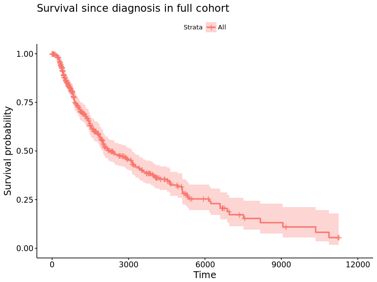
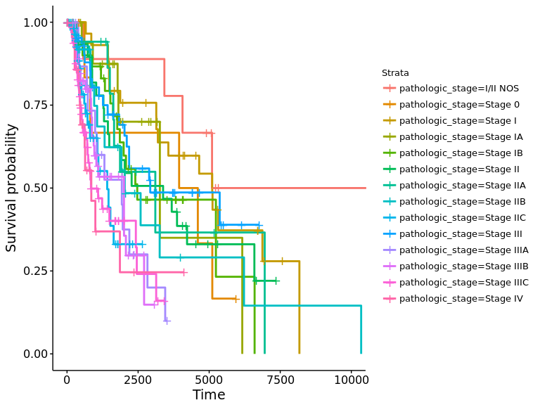
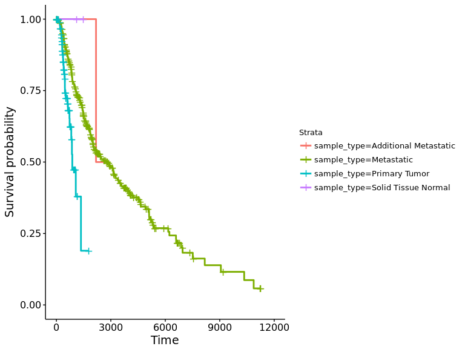
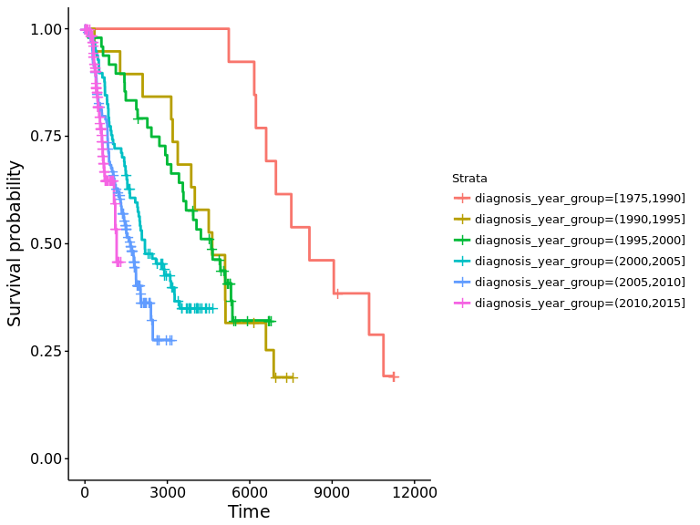
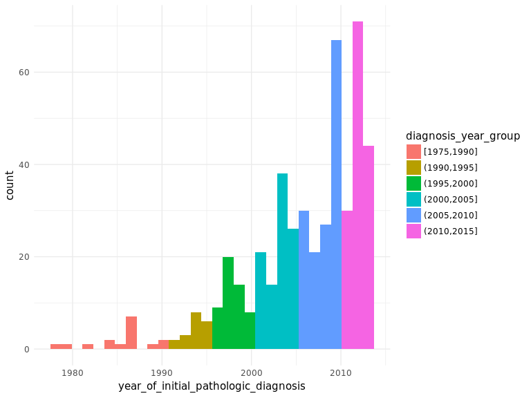

Analyze TCGA data for SKCM cohort
================
Jacqueline Buros & ...
2017-06-21

Here we are demonstrating the feasibility of analyzing genomic data using Stan. The first use case is to analyze somatic mutations for association with survival, after adjusting for key clinical variables with known prognostic status.

Clinical Data
-------------

First, download the clinical data. Here we are using the TCGA skin cutaneous melanoma (SKCM) cohort.

``` r
clin_df <- SuMu::get_tcga_clinical(cohort = "SKCM")

## format some clinical data variables

clin_df2 <- clin_df %>% 
  dplyr::mutate(stage_part1 = gsub(pathologic_stage,
                                   pattern = '(Stage [0I]+).*',
                                   replacement = '\\1'),
                diagnosis_year_group = cut(year_of_initial_pathologic_diagnosis,
                                           breaks = c(1975, 1990, 1995, 2000,
                                                      2005, 2010, 2015, 2020),
                                           include.lowest = TRUE),
                os_10y = ifelse(OS_IND == 1 & OS <= 10*365.25, 1, 0),
                sample = sampleID
                )
```

### Review clinical data

For this analysis we will consider the survival time in since initial pathologic diagnosis.

``` r
fit <- survfit(Surv(OS, OS_IND) ~ 1,
                  data = clin_df2)
survminer::ggsurvplot(fit) + 
  ggtitle('Survival since diagnosis in full cohort')
```



Plotting by stage, although the time of 'stage' determination may be confounded if not collected at time of initial diagnosis.

``` r
fit <- survfit(Surv(OS, OS_IND) ~ pathologic_stage,
                  data = clin_df2)
survminer::ggsurvplot(fit, legend = "right")
```



There also seem to be differences by tumor type.

``` r
fit <- survfit(Surv(OS, OS_IND) ~ sample_type,
                  data = clin_df2)
survminer::ggsurvplot(fit, legend = "right")
```



(Aside: I wonder how similar tumor type is to sample type? For example, we could have a metastatic patient where the sample was obtained from the primary tumor. We will want to adjust our genetic data analysis for the sample type but may want to estimate prognosis according to the tumor type?)

A variable like `year_of_initial_pathologic_diagnosis` is guaranteed to be unconfounded since we can safely assume it was collected at the time of diagnosis.

``` r
fit <- survfit(Surv(OS, OS_IND) ~ diagnosis_year_group,
                  data = clin_df2)
survminer::ggsurvplot(fit, legend = 'right')
```



This makes it pretty clear that we have a strong "survival" bias to our data. This would suggest that, among people whose diagnosis was made in the 90s, only those who survived long enough to be enrolled were included in the study.

Let's look at a histogram of years of initial diagnosis.

``` r
ggplot(clin_df2, aes(x = year_of_initial_pathologic_diagnosis,
                     fill = diagnosis_year_group)) + 
  geom_histogram() + 
  theme_minimal()
```



Let's look at the time since initial diagnosis (presumably, the time from enrollment to diagnosis).

Finally, we can visualize a more comprehesive set of clinical variables.

``` r
fit <- survival::coxph(Surv(OS, OS_IND) ~
                         age_at_initial_pathologic_diagnosis + 
                         sample_type +
                         breslow_depth_value + initial_weight + 
                         strata(year_of_initial_pathologic_diagnosis),
               data = clin_df2)
print(fit)
```

    ## Call:
    ## survival::coxph(formula = Surv(OS, OS_IND) ~ age_at_initial_pathologic_diagnosis + 
    ##     sample_type + breslow_depth_value + initial_weight + strata(year_of_initial_pathologic_diagnosis), 
    ##     data = clin_df2)
    ## 
    ##                                          coef exp(coef)  se(coef)     z
    ## age_at_initial_pathologic_diagnosis  0.018324  1.018493  0.006078  3.01
    ## sample_typeMetastatic                0.697124  2.007970  1.046439  0.67
    ## sample_typePrimary Tumor             1.156752  3.179590  1.077900  1.07
    ## breslow_depth_value                  0.014482  1.014587  0.008354  1.73
    ## initial_weight                      -0.000223  0.999777  0.000471 -0.47
    ##                                          p
    ## age_at_initial_pathologic_diagnosis 0.0026
    ## sample_typeMetastatic               0.5053
    ## sample_typePrimary Tumor            0.2832
    ## breslow_depth_value                 0.0830
    ## initial_weight                      0.6362
    ## 
    ## Likelihood ratio test=16.3  on 5 df, p=0.00607
    ## n= 338, number of events= 166 
    ##    (143 observations deleted due to missingness)

Somatic Mutations Data
----------------------

We can download the somatic mutations to supplement the phenotypes.

``` r
mut_df <- SuMu::get_tcga_somatic_mutations(cohort = "SKCM") %>%
  dplyr::mutate(gene_aa = paste0(gene, ":",Amino_Acid_Change),
                gene_effect = paste0(gene, ":",effect)
                )
```

Check the most frequent mutations.

``` r
mut_df_missense = mut_df %>% dplyr::filter(effect == "Missense_Mutation")
mut_df_missense$gene_aa = paste0(mut_df_missense$gene, ":", mut_df_missense$Amino_Acid_Change)
mut_df_missense %>% select(gene_aa) %>% table %>% sort %>% rev %>% as.data.frame %>% head(10)
```

    ##                  . Freq
    ## 1     BRAF:p.V600E  206
    ## 2      NRAS:p.Q61R   56
    ## 3     BRAF:p.V600M   40
    ## 4      NRAS:p.Q61K   38
    ## 5      NRAS:p.Q61L   19
    ## 6      RAC1:p.P29S   17
    ## 7     IDH1:p.R132C   15
    ## 8    SPTLC3:p.R97K   13
    ## 9  SLC27A5:p.T554I   13
    ## 10  MAP2K1:p.P124S   13

Copy Number and Gene Expression Data
------------------------------------

We can also download gene expression and gene-level copy number data.

``` r
exp_data = get_tcga_gene_expression(cohort = "SKCM")
cnv_gene = get_tcga_copy_number_gene(cohort = "SKCM")
```

Gene expression and copy number data should correlate. We can check.

``` r
# convert to matrix
exp_mat = exp_data %>% as.data.frame %>% tibble::column_to_rownames("sample") %>% as.matrix
dim(exp_mat)
```

    ## [1] 20530   474

``` r
cnv_mat = cnv_gene %>% as.data.frame %>% tibble::column_to_rownames("Gene Symbol") %>% as.matrix
dim(cnv_mat)
```

    ## [1] 24776   367

``` r
# get genes and samples with both expression and copy number data
common_samples = intersect(colnames(cnv_mat), colnames(exp_mat))
common_genes = intersect(rownames(cnv_mat), rownames(exp_mat))

# subset to common genes and samples
exp_mat = exp_mat[common_genes, common_samples]
dim(exp_mat)
```

    ## [1] 17944   366

``` r
cnv_mat = cnv_mat[common_genes, common_samples]
dim(cnv_mat)
```

    ## [1] 17944   366

``` r
# get highly expressed genes
top_genes = rowMeans(exp_mat) %>% sort %>% rev %>% head(5000) %>% names %>% sort

# select 10 random samples
random_samples = sample(common_samples, 10)

# keep only highly expressed genes
exp_mat = exp_mat[top_genes, random_samples]
dim(exp_mat)
```

    ## [1] 5000   10

``` r
cnv_mat = cnv_mat[top_genes, random_samples]
dim(cnv_mat)
```

    ## [1] 5000   10

``` r
# run correlations
diag(cor(cnv_mat, exp_mat)) %>% round(3) %>% as.data.frame
```

    ##                     .
    ## TCGA-EE-A20H-06 0.253
    ## TCGA-ER-A3EV-06 0.242
    ## TCGA-D9-A1X3-06 0.136
    ## TCGA-WE-A8ZY-06 0.228
    ## TCGA-ER-A42K-06 0.130
    ## TCGA-GN-A268-06 0.167
    ## TCGA-EE-A2GI-06 0.174
    ## TCGA-D3-A1Q5-06 0.138
    ## TCGA-D3-A1Q6-06 0.046
    ## TCGA-EE-A3JE-06 0.106

There is some correlation between expression and copy number data as expected.

Prepare mutation data for analysis
----------------------------------

Manual data preparation

``` r
mutation_counts <- mut_df %>%
  dplyr::left_join(clin_df2 %>% 
                     dplyr::select(sample, os_10y),
                   by = 'sample') %>%
  dplyr::filter(!is.na(os_10y)) %>%
  dplyr::filter(effect == "Missense_Mutation") %>%
  dplyr::group_by(gene) %>%
  dplyr::mutate(gene_count = n()) %>%
  dplyr::ungroup() 

top_genes <- mutation_counts %>%
  dplyr::distinct(gene, .keep_all = TRUE) %>%
  dplyr::top_n(gene_count, n = 10) %>%
  dplyr::select(gene)

mutation_matrix <- mutation_counts %>%
  dplyr::semi_join(top_genes) %>%
  dplyr::distinct(sample, gene_aa, DNA_VAF) %>%
  tidyr::spread(key = gene_aa, DNA_VAF, fill = 0)

glm_df <- mutation_matrix %>%
  dplyr::left_join(clin_df2 %>% 
                     dplyr::select(sample, os_10y),
                   by = 'sample')
```

Using functions within package

``` r
devtools::load_all('.')

# ## testing prep_biomarker_data as a whole
# glm_df <- SuMu::prep_biomarker_data(
#   data = clin_df2,
#   biomarker_data = mut_df,
#   biomarker_formula = 1 ~ gene_effect,
#   id = 'sample'
# )


top_genes <- mut_df %>%
  dplyr::filter(effect == "Missense_Mutation") %>%
  dplyr::select(gene) %>%
  dplyr::group_by(gene) %>%
  dplyr::mutate(gene_count = n()) %>%
  dplyr::ungroup() %>%
  dplyr::distinct(gene, .keep_all = TRUE) %>%
  dplyr::arrange(-gene_count) %>%
  head(10) %>%
  .$gene

# subset mutations to just chr7 (BRAF) to keep it small for testing
mut_df_subset = mut_df %>% dplyr::filter(gene %in% top_genes)

# create formula
f <- stringr::str_c('os_10y ~ `',
stringr::str_c(unique(mut_df_subset$gene_effect),
collapse = '` + `'),
'`')
my_formula <- as.formula(f)

clin_df3 <- clin_df2 %>% dplyr::select(sample, os_10y)

# new
g <- fit_glm(
  data = clin_df3,
  formula = my_formula,
  biomarker_data = mut_df_subset,
  biomarker_formula = 1 ~ gene_effect,
  id = 'sample',
  stanfit_func = NULL)
```

Fit `stan-glm` model to these genetic data, without clinical covariates
-----------------------------------------------------------------------

``` r
# construct input formula
gene_names <- names(mutation_matrix)[-1]
my_formula <- as.formula(
  stringr::str_c('os_10y',
                 '~ `',
                 stringr::str_c(gene_names,
                                collapse = '` + `'),
                 '`')
  )


# call to `stan_glm`
glmfit <- rstanarm::stan_glm(
  data = glm_df,
  formula = my_formula,
  sparse = TRUE,
  family = binomial(),
  chains = 4,
  prior = rstanarm::hs_plus()
)
```

Visualize
---------

    summary_table=feature_table(glmfit)
    feature_graph(glmfit)
    view_feature(mutation_matrix,clin_df2,gsub("`","",rownames(summary_table)[1]))
    view_feature(mutation_matrix,clin_df2,gsub("`","",rownames(summary_table)[nrow(summary_table)]))
